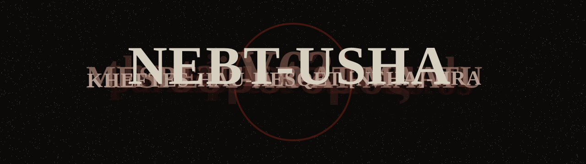
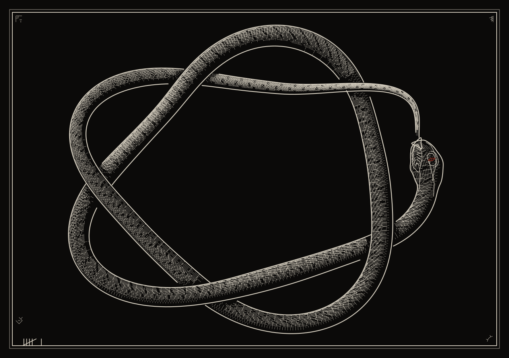

<!-- banner:start -->

  <picture>
    <source media="(prefers-color-scheme: light)" srcset="banner-light.svg">
    
  </picture>

<!-- banner:end -->

Computer vision. Multi-task detection. Language models.

  <picture>
    <source media="(prefers-color-scheme: light)" srcset="serpent-light.svg">
    
  </picture>

  <picture>
    <source media="(prefers-color-scheme: light)" srcset="https://raw.githubusercontent.com/palimpsest-ouroboros/palimpsest-ouroboros/output/snake-light.svg">
    
  </picture>

ἓν τὸ πᾶν

<!-- strata:start -->

| generation | sha | layers |
| ---: | --- | ---: |
| 0 | 2967804 | 1 |
| 1 | 3a0b0cf | 2 |
| 2 | 27e1db0 | 3 |

<!-- strata:end -->

mehen

<em>pẖr mḥn ḥꜣ wjꜣ</em>

<em>A text scraped and rewritten, forever eating its own beginning.</em>

