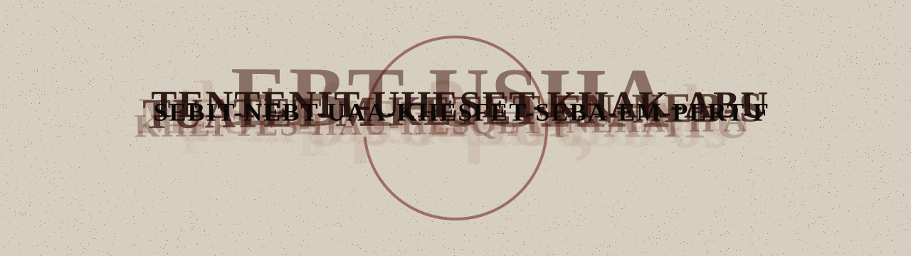

  <picture>
    <source media="(prefers-color-scheme: dark)" srcset="banner-dark.svg">
    
  </picture>

Computer vision. Multi-task detection. Language models.

  <picture>
    <source media="(prefers-color-scheme: dark)" srcset="https://raw.githubusercontent.com/ganeshsharma/palimpsest-ouroboros/output/snake-dark.svg">
    
  </picture>

strata

<!-- strata:start -->

| generation | sha | layers |
| ---: | --- | ---: |

<!-- strata:end -->

<em>A text scraped and rewritten, forever eating its own beginning.</em>

